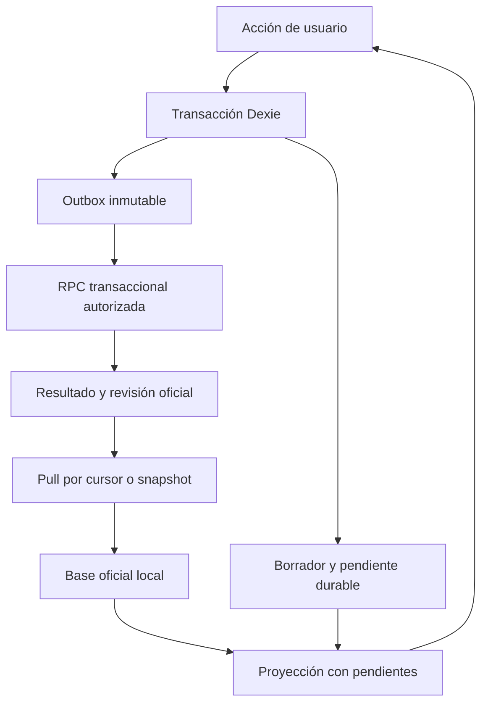

# Persistencia local y sincronización

Diseño, sin SDK instalado ni RPC/migración remota ejecutados.



## IndexedDB / Dexie

Nombre aislado `mora-v2:<environment>:<business_id>:<dataset_epoch>:<device_id>`; nunca abrir o borrar base V1. Dexie es almacenamiento, **no usar Dexie Cloud**: autoridad remota Supabase aprobada. Versión local independiente de versión contrato RPC y backup.

| Store / índices propuestos | Uso |
| --- | --- |
| metadata `key` | environment/business/epoch, schema, cursor, último contacto/ancla de reloj, rango compatible |
| drafts `id,updatedAt` | carrito, snapshots precios, pago aún no confirmado; recarga conserva borrador |
| officialEntities `[type+id],type,revision` | proyecciones confirmadas, no pendientes |
| officialBatches `revision` | auditoría/cambios necesarios para reconstruir vistas |
| localCommands `id,&[deviceId+deviceSeq],status,createdAt` | sobre inmutable y hechos locales, estado de envío separado |
| outbox `commandId,status,nextAttemptAt,[deviceId+deviceSeq]` | reintentos, lease de envío, error clasificado; payload vive en localCommands |
| results `commandId,revision` | acuse completo, revisión, hash; persistir antes de retirar outbox |
| localReviews `id,commandId,status` | revisión oficial o cuarentena local; origen distingue ambos |
| syncStaging `[snapshotId+page],snapshotId` | descarga y validación antes de swap de base oficial |
| deviceCounter `deviceId` | secuencia en misma transacción que enqueue |

Confirmar venta: generar IDs/hash fuera de transacción; abrir `rw` sobre borrador, contador, comandos, outbox, reviews; validar y escribir comando, aumentar secuencia, marcar borrador consumido por ese ID; commit exitoso antes de «Guardada». Doble click utiliza ID asociado al borrador, no genera un segundo. Fallo/cuota: no mostrar éxito, preservar formulario y permitir respaldo. Solicitar almacenamiento persistente si disponible y observar cuota; nunca prometer inmunidad a borrado del navegador.

No esperar fetch, temporizadores, crypto ni otros I/O dentro de transacción Dexie. No capturar y silenciar error dentro del `rw`. Lecturas reactivas son adaptadores de presentación, no comandos en render/efectos React.

Una base oficial + replay de pendientes, **sin mutar la oficial al guardar localmente**. Una venta confirmada ya incorporada no se vuelve a aplicar como overlay. Ack puede llegar antes de pull: mantener overlay hasta aplicar batch/revisión correspondiente, pero mostrar confirmada remota. En pull, entidades + resultados de nuestros IDs + cursor se escriben juntos; retirar overlay y outbox en ese mismo commit. UI no suma ack y evento como ventas distintas.

Varias pestañas: Web Locks opcional y lease IDB para emisor; contador y unicidad locales son garantía aunque no haya Web Locks. Lease vencido vuelve a encolar tras crash; idempotencia remota resuelve doble envío. Envío serial por instalación para respetar dependencias; una dependencia en conflicto bloquea descendientes, no todo el equipo. Secuencia no ordena otros equipos ni requiere huecos inexistentes.

## Sobre y API propuestos

```json
{
  "contractVersion": 1,
  "businessId": "uuid",
  "datasetEpoch": "uuid",
  "commandId": "uuid",
  "deviceId": "uuid",
  "deviceSeq": "12",
  "registeredAt": "2026-10-10T06:00:00Z",
  "timezone": "America/Argentina/Salta",
  "type": "RecordSale",
  "dependencies": [],
  "expectedVersions": {},
  "payload": {"saleId": "uuid", "lines": [], "payments": [], "debt": null}
}
```

Es ejemplo de sobre, no venta válida: líneas vacías fallan validación. Hash SHA-256 de JSON canónico (claves ordenadas, valores exactos, UTF-8, enteros o strings decimales, sin floats/undefined); servidor recalcula, nunca confía en hash cliente. Reintento no cambia timestamps/payload. Cambio humano crea comando nuevo con referencia al original.

| Endpoint lógico | Entrada / salida y seguridad |
| --- | --- |
| `submit_command_v1` | Sobre + sesión JWT; resultado `{commandId,hash,status,revision,entityVersions,reviewIds,errorCode}`; status applied/applied_with_review/conflict/invalid; transacción única |
| `command_status_v1` | IDs del negocio; resultados durables; antes de reenviar tras restaurar |
| `pull_changes_v1` | epoch, afterRevision, limit; batches **completos** ordenados, nextCursor, highWatermark, hasMore; cada batch incluye efectos/proyecciones/resultados sin secretos |
| `begin_snapshot_v1` / `snapshot_page_v1` | snapshotId, revisión R, epoch, schema, páginas, conteos, hash; contenido inmutable en R; expira y se reintenta sin destruir base |
| `create_invite_v1` / `approve_device_v1` / `revoke_device_v1` | Solo online con autorización fresca y verificación de sesión; flujo en seguridad |

Timeout/5xx: retry con backoff exponencial+jitter, máximo propuesto 60s; 429 respetar retry-after; 401 refrescar sesión una vez, no bucle; 403 congelar envíos y preservar datos; versión incompatible conservar outbox y pedir actualización; conflict requiere acción, no retry infinito. `invalid` no se descarta: revisión local. Propuesta de límites: 100 líneas/comando, 256KB/payload, pull 100 batches/página; medir y ajustar en entorno aislado.

## Transacción Postgres e idempotencia

Inicialmente serializar operaciones por negocio con lock de fila `business_clock FOR UPDATE`. Es simple para 3–4 equipos, sacrifica throughput; medir tiempo y no mantener lock durante I/O. Revocación/invitaciones/resolución también toman ese lock, así se ordenan con comandos. No usar secuencia PostgreSQL global como cursor: un número reservado puede hacer commit tarde y perderse en un pull.

1. Validar JWT/sesión/instalación/membresía vigentes, negocio/epoch y contrato. Nunca confiar en business/device del payload para autorización.
2. Bloquear reloj del negocio, revalidar acceso (la revocación podría haberse confirmado mientras esperaba).
3. Buscar `(business_id,command_id)`. Mismo hash devuelve resultado guardado; distinto hash = `IDEMPOTENCY_KEY_REUSED` sin efectos. `(business_id,device_id,device_seq)` repetido con otro ID = cuarentena; no renumerar operación automáticamente.
4. Verificar dependencias y versiones; total/pagos/racional/FKs. Crear resultado de conflicto/invalid estable para rechazos deterministas; errores temporales/dependencia aún pendiente no consumen resultado definitivo.
5. Aplicar ledgers/asignaciones/revisiones y proyecciones; incrementar reloj en transacción; guardar batch completo, audit y resultado. Todo hace commit o rollback; fallo tras commit antes del ack se recupera por mismo ID.

Retener claves/resultados de idempotencia durante toda vida del dataset; compactar payload pesado solo conservando ID, hash y resultado suficiente. No reusar IDs tras restauración ni eliminar tombstones.

## Pull, bootstrap y snapshots

`highWatermark` se toma al comenzar pull; leer `after < revision <= highWatermark`, páginas sin cortar un batch transaccional. Una revisión de reloj se publica solo al commit y en orden por lock: ninguna revisión anterior puede aparecer tarde. Aplicar batch/cursor local atómicamente. Realtime solo notifica negocio/revisión y activa pull autorizado; red, foco, reapertura y comprobación periódica también lo activan.

Snapshot debe ser consistente en R: materializar/exportar con snapshot transaccional servidor; paginar tablas vivas separadamente **no** es snapshot. Descarga en staging, valida negocio/epoch/esquema/hashes/conteos; reemplaza solo base oficial + cursor R mediante commit; conserva drafts/outbox y reaplica pendientes; luego pull > R. Si cursor expiró por retención, exigir snapshot, no saltar al último cursor. Si epoch no coincide, cuarentena, sin aplicar base de otro negocio. Política propuesta: retención delta 90 días; snapshots no sustituyen archivo de recuperación independiente.

«Al día» significa outbox sin pendientes enviables, pull completo hasta watermark comprobado, sesión válida; mostrar fecha de última comprobación. No afirma ausencia de ventas aún offline en otros equipos. Revisión de stock/FIFO es indicador independiente: sincronizar no la resuelve.

## PWA y migraciones

Workbox cachea shell/assets versionados; no cachear JWT/RPC de negocio mediante estrategia genérica ni almacenar credenciales en caché HTTP. Fotos verificadas opcionales con presupuesto de almacenamiento, evictables; outbox jamás evictable por lógica de app. SW update requiere borradores durables, transacción terminada y compatibilidad; no exige red/outbox vacía para siempre.

Upgrade Dexie aditivo y probado sobre fixtures antiguos con pendientes; si falla, conservar DB y modo recuperación, nunca deleteDatabase. Payloads pendientes conservan su versión original; adaptador compatible o cuarentena, nunca transformación silenciosa de hash. Servidor mantiene versiones compatibles durante transición; `contract_min/max`, `schema_version`, `backup_version` separados. Ensayar equipo varios días offline con versión anterior antes de retiro de contrato. No automatizar migrations Supabase con CI de esta PR.
