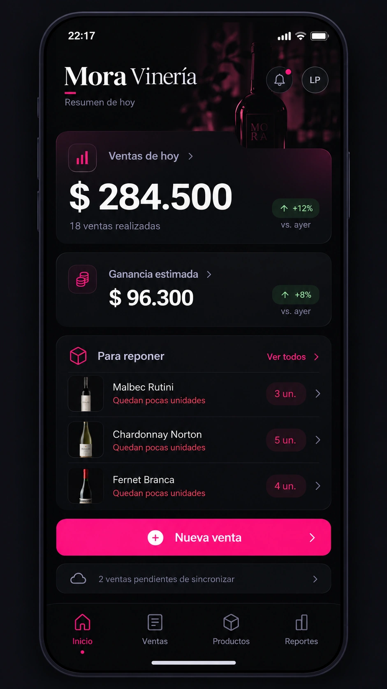
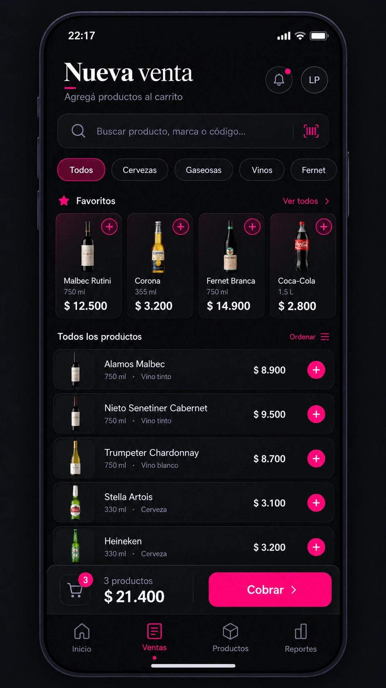
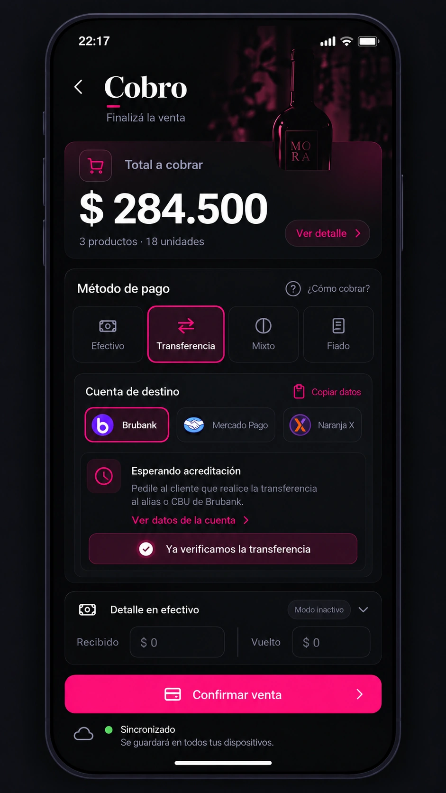
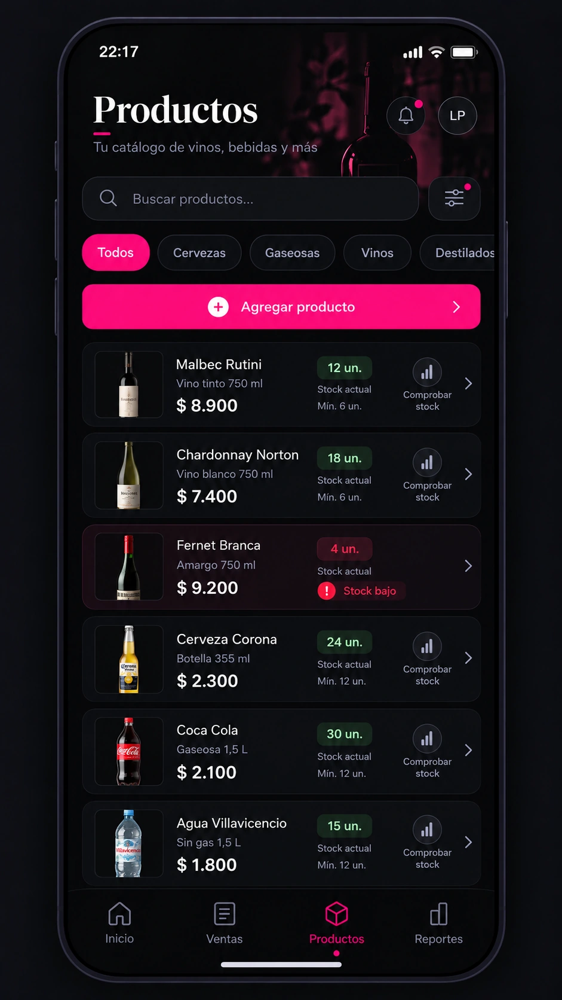
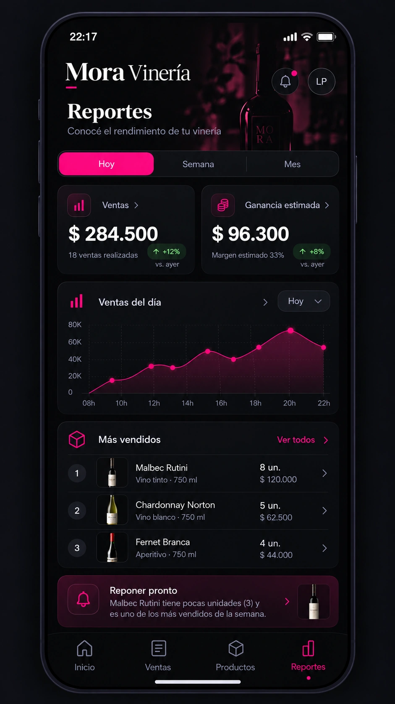

# Mora Vinería 2.0 — Mockups móviles aprobados

**Aprobación visual:** 9 de octubre de 2026.  
**Estado:** referencias oficiales de diseño; **NO** son una aplicación implementada ni un contrato literal de componentes.  
**Origen:** cinco imágenes generadas y aprobadas expresamente por el usuario, exportadas a WebP de alta calidad conservando la resolución 941 × 1672 para reducir el tamaño de Git.

> Prioridad absoluta **mobile-first**. Las propuestas visuales anteriores UX 01 y UX 02/HTML quedaron descartadas como referencias de interfaz. Mantener sus investigaciones funcionales solo cuando sean compatibles con las decisiones actuales. No tomar mockups de escritorio como objetivo visual.

## Galería

| Inicio | Nueva venta |
| --- | --- |
|  |  |

| Cobro | Productos |
| --- | --- |
|  |  |

| Reportes |
| --- |
|  |

## Elementos visuales a preservar

- **Rosa fucsia** fuerte como acento y acción principal (referencia `#FF0A89`), sobre carbón y negros nocturnos; **no** usar mora vino como acento de marca.
- Composición de aplicación **para teléfono**: navegación inferior Inicio / Ventas / Productos / Reportes, sin perspectiva ni adaptaciones centradas en escritorio.
- Jerarquía marcada, títulos expresivos, números legibles, imágenes de productos cuidadosamente saneadas y superficies oscuras con profundidad moderada.
- Inicio: protagonismo de Ventas de hoy, ganancia estimada, aviso de reposición y Nueva venta.
- Ventas: búsqueda rápida, categorías sencillas, favoritos, selección multiproducto y acceso persistente al cobro.
- Cobro: efectivo/transferencia/mixto/fiado, Brubank de forma predeterminada, **acreditación confirmada por operador**, no integración bancaria supuesta.
- Productos: catálogo reconocible, precio, stock y comprobación física.
- Reportes: Hoy/Semana/Mes, ventas y ganancia con tendencias útiles.

## Guardarraíles de implementación (corregir al traducir mockup a interfaz)

1. **Datos ficticios:** las cifras, usuarios, productos y marcas son ejemplos visuales, no catálogo real, no cuentas verificadas y no saldos confirmados. Los importes o cantidades entre pantallas no necesariamente coinciden, por lo que deben venir de un único estado consistente en la app.
2. **No copiar estados falsos:** un indicador como «Sincronizado» solo se puede mostrar cuando el servidor haya confirmado los datos. En un mockup estático no describe el estado de una futura venta.
3. **No confirmar transferencia sin verificar:** el flujo requiere comprobación manual de acreditación antes de aceptar la venta como cobrada por transferencia.
4. **Texto y contraste:** comprobar el contraste WCAG; texto blanco sobre fucsia `#FF0A89` puede ser insuficiente para tipografía normal; adaptar tono o texto y validar en teléfonos reales.
5. **Stock:** los mínimos exhibidos son ilustrativos. En producto real usar **objetivo por artículo** y regla que se apruebe; no imponer mínimos numéricos globales.
6. **FIFO:** ganancia estimada debe surgir de costos de lotes atribuidos a ventas; offline, costo desconocido o sobreventa puede requerir etiqueta provisional y revisión.
7. **Imágenes:** no usar las imágenes generadas como fuente automática para el catálogo. Comprobar variante, marca, volumen, licencia, compresión y almacenamiento local.
8. **Pantallas faltantes:** estos cinco mockups **no** aprueban un flujo integral completo. Diseñar carrito, recibo/confirmación, fiados, reposición, caja y cuentas, primera carga, ajustes, dispositivos y estados offline/error antes de programar.
9. **Móvil primero:** probar interacción real entre 360 y 430 px de ancho, teclado abierto, zona segura inferior, uso nocturno con una mano y accesibilidad. Adaptar escritorio más adelante sin que condicione la experiencia del celular.
10. **Solo referencias:** no copiar automáticamente texto, números, tamaño exacto de tarjetas o artefactos propios de una imagen generada; revisar legibilidad, coherencia y contenido.

## Próxima etapa

1. Traducir estos mockups a especificaciones UX y sistema visual: colores, tipografía, espaciado, superficies, íconos, botones, estados y puntos de quiebre.
2. Completar **mockups móviles** de las pantallas necesarias que faltan, principalmente carrito, reposición y caja/cuentas, en esta misma dirección estética.
3. Diseñar un **prototipo interactivo móvil** basado en esta identidad, con recorridos completos y datos falsos, para probar antes de escribir lógica de producción.
4. Tras validación, acordar modelo de datos por lotes FIFO, sincronización y seguridad para Supabase; recién entonces implementar con pruebas.

Las reglas de negocio vigentes siguen en `docs/07_cierre_relevamiento_16_preguntas.md` y `docs/02_sincronizacion_y_offline.md`.

## Revisión de mockups secundarios — 9/10/2026

**Feedback expreso del usuario:** de los intentos posteriores para Carrito, Reposición y Caja/Cuentas, **solamente resultó aceptable la primera composición de tres teléfonos sobre fondo blanco** (títulos superiores «Carrito», «Reposición», «Caja», y pestaña inferior adicional «Más»). Incluso esa composición se siente **algo alejada de los cinco mockups originales**; **NO está aprobada** como referencia final. Los tableros posteriores de diez pantallas y de tres teléfonos sobre fondo oscuro fueron rechazados por aspecto artificial/genérico («slop»). No subirlos como referencias aprobadas ni interpretar «está bien dentro de todo» como aprobación definitiva.

**Reglas para siguientes iteraciones:**
- Los cinco mockups guardados en esta carpeta son la **fuente visual principal e inalterada** hasta nueva aprobación.
- Tomar del único intento tolerado su claridad en cantidades, importes y distribución, pero no heredar automáticamente una quinta pestaña «Más»; conservar navegación principal de cuatro destinos.
- Diseñar y revisar cada pantalla adicional **por separado**, a resolución móvil, replicando cuidadosamente tipografía, materiales, composición, proporciones, iconografía, contraste y fucsia de las cinco referencias originales.
- Evitar tableros con diez teléfonos, nuevos lenguajes estéticos y ajustes improvisados entre pantallas. Separar fidelidad visual de validez funcional (la app tiene reglas aprobadas propias de FIFO, stock objetivo y saldos).
- No declarar aprobados Carrito, Reposición ni Caja/Cuentas hasta aceptación explícita del usuario.

