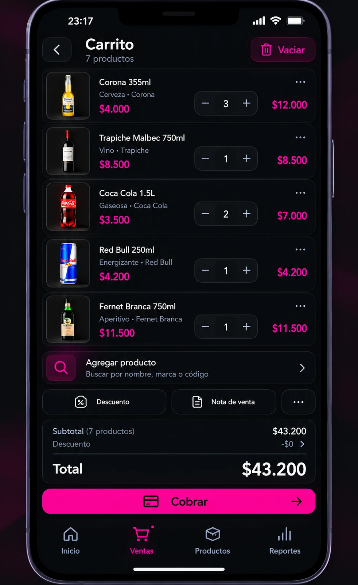

# Prototipos móviles V2 — diseños en evaluación

Estos artefactos son **prototipos para evaluar la experiencia de uso**. No tienen el mismo nivel de aprobación que las cinco pantallas de referencia oficial en [Mockups aprobados](../mockups-aprobados-v2/README.md).

## Carrito — aprobado como prototipo, no como diseño final

- **Fecha de validación:** 9 de octubre de 2026.
- **Decisión textual:** «Sí, para prototipo está bien».
- **Estado:** apto para prototipar el recorrido de venta y cobro, sujeto a refinamiento visual y funcional antes de su implementación definitiva.
- **Obligatorio al desarrollar:** mantener la estructura mobile-first, cuatro destinos de navegación, cantidades editables, cálculo consistente del importe y paso directo a cobro.
- **No copiar literalmente:** números, marcas, denominaciones, iconos o imágenes simulados; validar datos de ejemplo, cálculo real y ajuste de precio excepcional. El total ilustrativo se considera ficticio.
- **Aviso:** este archivo es una representación estática; no implica implementación de carrito, estado ni persistencia.

No incorporar esta pantalla a la carpeta `mockups-aprobados-v2` sin una aprobación explícita como referencia visual definitiva.

## Próximo diseño

**Reposición / preparación de pedido:** completar el recorrido de sugerencias según stock objetivo, unidades por fardo y envío por WhatsApp, sin duplicar la información resumida ya aprobada en Inicio/Productos.
