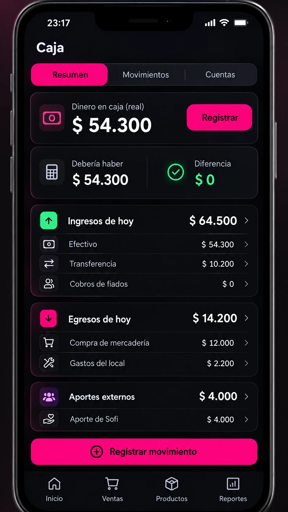

# Prototipos móviles V2 — diseños en evaluación

Estos artefactos son **prototipos para evaluar la experiencia de uso**. No tienen el mismo nivel de aprobación que las cinco pantallas de referencia oficial en [Mockups aprobados](../mockups-aprobados-v2/README.md).

## Carrito — aprobado como prototipo, no como diseño final

- **Fecha de validación:** 9 de octubre de 2026.
- **Decisión textual:** «Sí, para prototipo está bien».
- **Estado:** apto para prototipar el recorrido de venta y cobro, sujeto a refinamiento visual y funcional antes de su implementación definitiva.
- **Obligatorio al desarrollar:** mantener la estructura mobile-first, cuatro destinos de navegación, cantidades editables, cálculo consistente del importe y paso directo a cobro.
- **No copiar literalmente:** números, marcas, denominaciones, iconos o imágenes simulados; validar datos de ejemplo, cálculo real y ajuste de precio excepcional. El total ilustrativo se considera ficticio.
- **Aviso:** este archivo es una representación estática; no implica implementación de carrito, estado ni persistencia.

No incorporar esta pantalla a la carpeta `mockups-aprobados-v2` sin una aprobación explícita como referencia visual definitiva.

## Caja y cuentas — aprobada visualmente

- **Fecha de validación:** 9 de octubre de 2026.
- **Decisión textual:** «sí me gusta»; posteriormente el usuario solicitó expresamente subir la imagen.
- **Estado:** **aprobada visualmente** para guiar la pantalla Caja y cuentas, conservada aquí porque es una referencia secundaria que complementa las cinco primeras, no una sexta pantalla original.
- **Preferencia confirmada:** Resumen de caja compacto con pestañas «Resumen», «Movimientos» y «Cuentas». Los desgloses de ingresos, egresos y aportes de la segunda imagen aportada deben poder **expandirse y contraerse**, no saturar la pantalla principal.
- **Regla de negocio:** los fiados pendientes no son ingresos cobrados; **solo los pagos efectivamente recibidos** cuentan como cobro. Diferenciar facturación, ganancia bruta FIFO, saldos de caja/cuentas, movimientos de capital y compras de mercadería.
- **Advertencias de implementación:** cifras y nombres son ficticios; «dinero real en caja» debe basarse en un recuento introducido explícitamente y su fecha, nunca inferirse de la suma de ventas. El saldo esperado no es automáticamente el saldo real. Los traspasos entre cuentas propias no son ingresos de ventas. No inventar operaciones bancarias confirmadas.
- **Navegación:** mantener las cuatro pestañas aprobadas («Inicio», «Ventas», «Productos», «Reportes»). Caja y cuentas es una pantalla contextual, no necesita quinta pestaña «Más».

## Próximo diseño

**Reposición / preparación de pedido:** completar el recorrido de sugerencias según stock objetivo, unidades por fardo y envío por WhatsApp, sin duplicar la información resumida ya aprobada en Inicio/Productos.
